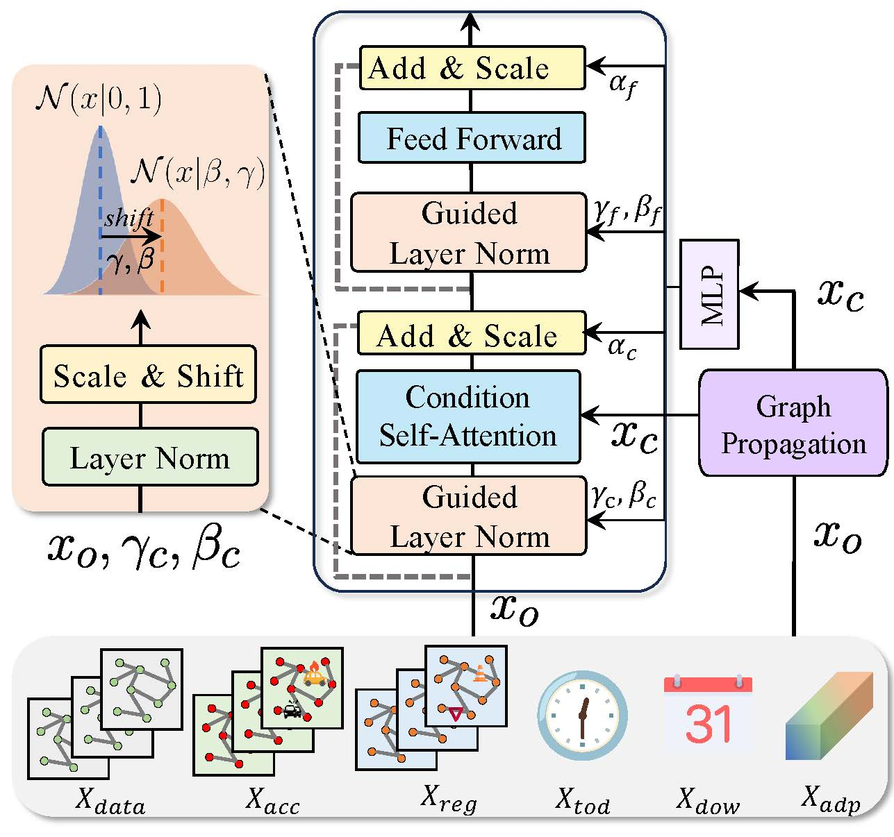

# <div align="center">**Single-Layer Conditional Transformer Performs Large-Scale Traffic Forecasting for Both Normal and Abnormal Scenarios**</div>
# <div align="center">**[Scalable Data Science]**</div>

## Abstract

Despite significant advancements in deep learning, accurately predicting traffic remains a major challenge in spatiotemporal forecasting. The difficulty lies in capturing the impact of abnormal factors such as traffic accidents and regulatory policies, which can introduce sudden disruptions to traffic status. However, existing models often omit abnormal factors due to difficulties in integrating sparse event data with continuous spatiotemporal patterns. To address this gap, we introduce two large-scale traffic datasets from Tokyo and California that incorporate traffic accident reports and regulatory information. We also propose ConFormer (Conditional Transformer), a novel framework designed to better integrate sparse traffic incidents with dense traffic states. Unlike conventional methods that rely on deep, multi-layer iterative interactions, ConFormer takes a more efficient approach. It first propagates traffic incident data through a simple graph propagation layer and then incorporates it into a conditioning attention mechanism within a guided normalization layer. With just a single-layer transformer, ConFormer outperforms the state-of-the-art STAEFormer in both predictive accuracy and computational efficiency, significantly reducing model complexity and resource demands, which offers a promising approach to integrating heterogeneous traffic data for more accurate and efficient forecasting.



## Quick Start

### Training Commands

```bash
cd model/
python train.py -d <dataset> -g <gpu_id>
```

> **Note**: The accident datasets will be released upon paper acceptance. The complete datasets and preprocessing code will be available in the project repository.
