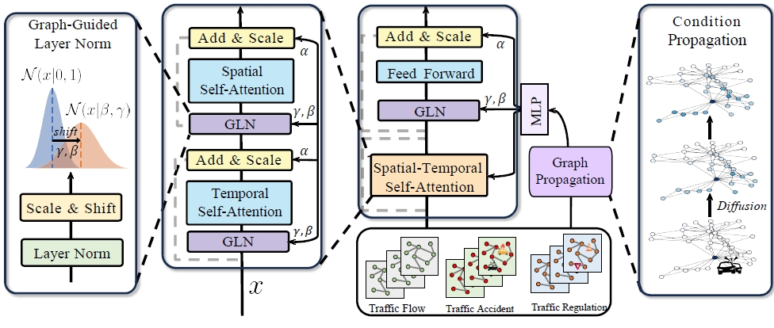

## Single-Layer Conditional Transformer Performs Large-Scale Traffic Forecasting for Both Normal and Abnormal Scenarios [Scalable Data Science]

# Abstract
Traffic prediction has long been an active research topic in the field of spatio-temporal data mining. Despite continuous advancements in deep learning, accurate forecasting of future traffic conditions remains a challenging problem. This is primarily due to the fact that future traffic patterns are influenced by various events, such as traffic accidents and traffic control. Existing methods often lack explicit modeling of these conditions, leading to suboptimal prediction performance, largely due to the absence of relevant data. To address these challenges, we introduce two comprehensive traffic datasets from Tokyo and California, which incorporate data on traffic accidents and control.  Building upon this dataset, we propose a novel transformer framework called ConFormer (Conditional Transformer), which integrates graph propagation with adaptive normalization layers, enabling the model to dynamically adjust spatial relationships and temporal distribution of nodes based on historical conditions. Our method demonstrates significant performance improvements over the current state-of-the-art STAEFormer, while simultaneously reducing computational overhead and parameter requirements. Extensive empirical evaluations conducted on these datasets consistently demonstrate that our model outperforms current mainstream spatio-temporal baselines across various metrics, underlining the efficacy and potential of our proposed approach in advancing the field of traffic prediction.

